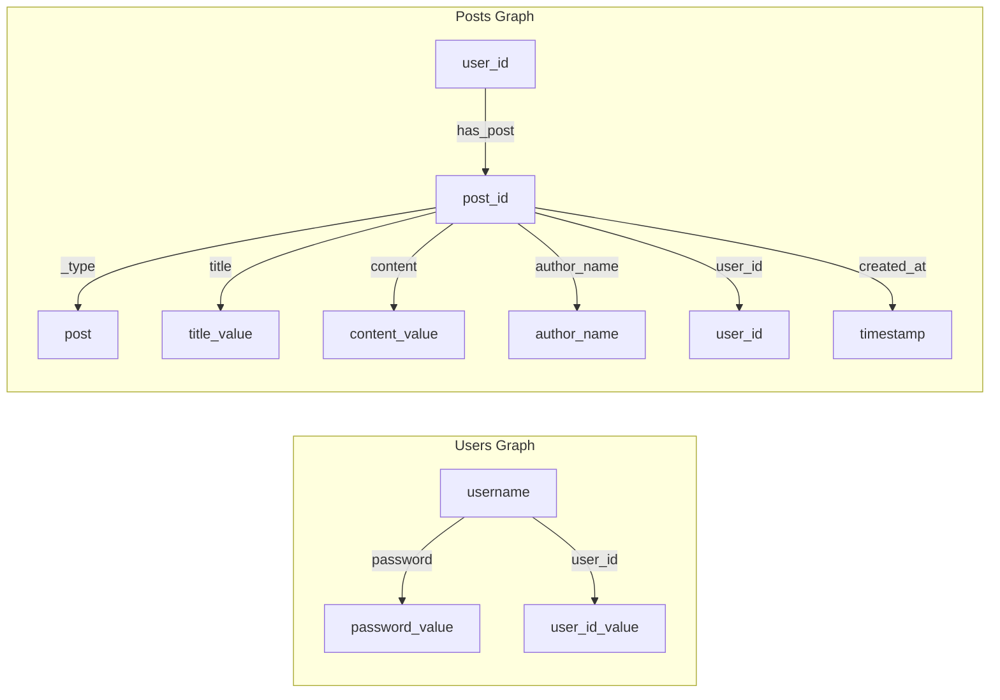

# Violit Blog Demo (CogDB Version)

A [CogDB](https://github.com/arun1729/cog) port of the original SQLite-based [Violit Blog demo](https://github.com/violit-dev/violit/tree/main/examples/2_violit_blog).

## Quick Start

```bash
pip install violit cogdb
python blog.py
```

Open http://localhost:8000 in your browser.

## Data Model



## Query Pattern

Uses CogDB's chained `out().tag().inc()` pattern to retrieve all properties in a single traversal:

```python
posts_graph.v().has("_type", "post").tag("post_id") \
    .out('title').tag('title').inc('title') \
    .out('content').tag('content').inc('content') \
    .out('author_name').tag('author_name').all()
```
